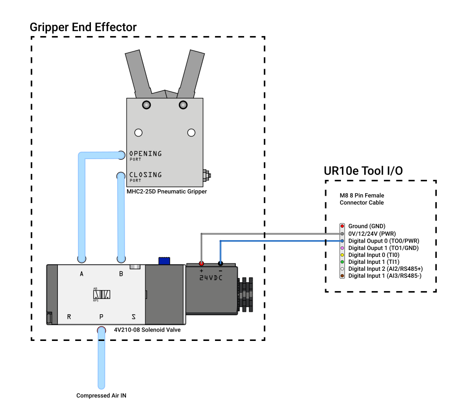

# Robotic Gripping
###### An example of a custom pneumatic gripper integration to get started with pneumatic actuation on a robotic arm.

## Overview
This repository contains everyting needed to get on understanding on how to integrate a pneumatic actuator on a robotic arm, in our case the [Universal Robot UR10e](https://www.universal-robots.com/products/ur10-robot/) (or any UR model) through the example of a bespoke and affordable pneumatic gripper system.

Included in the repository are:

- Custom Pneumatic Gripper CAD Files: For 3D printing the mountable structure of the gripper and the flexible fingers,
- Wiring Diagram: Including both pneumatic an electrical wiring information,
- Scripts: Grasshopper toolpath example.

## Note on the Signal Workflow

The workflow begins with the Grasshopper script embedding the extrusion commands (open and closed) into the URP file. This file instructs the UR10e to output a digital voltage signal (0-24V) on the digital ouput 0 of the tool I/O M8 female port (TO0). These signals is directly interpreted by the electronic solenoid valve to balance the airflow between output A (open) and B (closed), ultimately actuating the MHC2-25D pneumatic gripper.

The analog signals can also be overwritten in real-time using the UR Teaching Pendant.

**Grasshopper (Extrusion Command Embeded in URP file/G-Code ) ⟶ UR10e (Digital Output 0-24V) ⟶ Electronic Solenoid Valve (Gate A-B) ⟶ MHC2-25D Pneumatic Gripper (Open-Closed)**

## Components

- Generic MHC2-25D Pneumatic Gripper
- Generic 5-way 2-position Electronic Solenoid Valve (4V210-08)
- 6mm Pneumatic Pipe Kit 
- M5 6mm 90deg Pipe Fittings
- M5 and M6 Hex Socket Head Screws (Mostly short)
- Electrical Connectors (JST XH in our case)
- M8 8 Pin Female Connector Cable

Both pneumatic gripper and electronic solenoid valve are industrial-grade, affordable, and readily available.
This whole setup cost less than 60 USD at the time of writing.

## Setup and Installation

### Prerequisites

- UR10e Robotic Arm (or any UR models),
- Afformentioned Components,
- Air Compressor,
- Rhino Grasshopper: For generating toolpath commands.

### Wiring Diagram

Refer to the following wiring diagram for the electrical connections.

Diagram made with the open-source tool [Fritzing](https://fritzing.org/).

### CAD Files

A structural body system fitting the robotic arm's flange was designed and fabricated connecting a generic MHC2-25D pneumatic gripper and a generic 5-way, 2-position solenoid valve. Based on [the fin ray effect](https://doi.org/10.1007/s40430-024-04957-0), an adaptative and interchageable set of robotic fingers was also modeled.
The later were also 3D printed with PLA and are working as expected. However, a PETG or TPU version would yield better results although the design would need to be adapted.

- [Gripper_Body](CAD/Gripper_Body.stl) 3D printing file.
- [Adaptative_Fingers](CAD/Adaptative_Fingers.stl) 3D printing file.

If customization is desired, a [Rhino file](CAD/Pneumatic_Gripper_System.3dm) of the gripper system is in the repository.

### Grasshopper Definition

To control the pneumatic gripper on the UR10e, a basic Grasshopper definiton was made: [RoboticGripping_Basic_Script](Script/RoboticGripping_Basic_Script.gh).

This definition is based on a previous work about [Robotic Printing](https://github.com/cxlso/Robotic_Printing), follows the same visual framework and is also using the [Robots](https://www.food4rhino.com/en/app/robots) plugin by Visose.

Instead of using the standard "Set Digital Output" component from the Robots plugin, the "Custom Command" was used to manualy set the tool digital output with the following commands: "set_tool_digital_out(0, True)" and "set_tool_digital_out(0, False)". 

This work-around was required because TO0 or TO1, the digital outputs of the flange can't be accessed with the standrad "Set Digital Output" (DO). The solution was found in this [discussion](https://github.com/visose/Robots/discussions/222).

## Pictures and Videos

https://github.com/user-attachments/assets/d02727e6-7be6-4e2c-b9e1-815e54aebf75

https://github.com/user-attachments/assets/525a650b-c3f4-41bc-b1ef-6184d4fb3f9b

## Contributing

Contributions are welcome! Please submit a pull request or open an issue to discuss any changes or improvements.

## License

[![CC BY-NC-SA 4.0][cc-by-nc-sa-shield]][cc-by-nc-sa]

This work is licensed under a
[Creative Commons Attribution-NonCommercial-ShareAlike 4.0 International License][cc-by-nc-sa].

[![CC BY-NC-SA 4.0][cc-by-nc-sa-image]][cc-by-nc-sa]

[cc-by-nc-sa]: http://creativecommons.org/licenses/by-nc-sa/4.0/
[cc-by-nc-sa-image]: https://licensebuttons.net/l/by-nc-sa/4.0/88x31.png
[cc-by-nc-sa-shield]: https://img.shields.io/badge/License-CC%20BY--NC--SA%204.0-lightgrey.svg

## Acknowledgements

This project was developed on my own initiative at the [School of Architecture of Florida Atlantic University](https://www.fau.edu/artsandletters/architecture/) within the Environmental Design and Natural Materials lab, directed by Shermeen Yousif.
